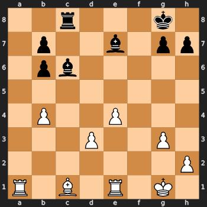
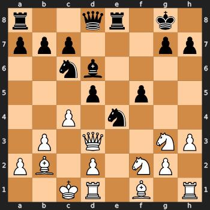
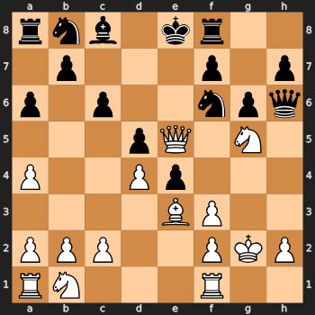

# Chess D3PM: Discrete Diffusion Models for Chess Position Generation

A PyTorch implementation of D3PM (Structured Denoising Diffusion Models in Discrete State-Spaces) adapted for unconditional chess position generation and inpainting. This project uses an absorbing state diffusion process paired with a Diffusion Transformer (DiT) to learn and generate realistic chess positions.

## Overview

This implementation explores discrete diffusion models for chess position generation using two distinct board representations:

1.  **Square-Centric (SC) Representation**:
    *   Each of the 64 squares is a token.
    *   Token value represents the piece on that square (12 piece types + empty).
    *   Sequence Length: 64, Vocabulary Size: 14 (12 pieces + 1 empty + 1 absorbing state).

2.  **Piece-Centric (PC) Representation**:
    *   Each token represents one of 32 canonical pieces (e.g., White King, Black Queen, White Pawn 1, etc.).
    *   Token value represents the square that piece is on (1-64) or `0` if the piece is off the board.
    *   Sequence Length: 32, Vocabulary Size: 66 (64 squares + 1 off-board + 1 absorbing state).

The model uses an absorbing state diffusion process where tokens (squares or pieces) gradually transition to an absorbing state during the forward process, and the reverse process learns to reconstruct valid chess positions.

## Architecture

-   **Diffusion Engine**: D3PM with absorbing state transitions and cosine noise schedule.
-   **Backbone Model**: Diffusion Transformer (DiT) with adaptive layer normalization, adapted to handle varying sequence lengths (`64` for SC, `32` for PC).
-   **Training Objective**: Cross-entropy loss with optional variational bound term.
-   **Sampling**: Supports full generation, partial completion (inpainting), and top-k filtered sampling.

## Key Features

-   Unconditional chess position generation from pure noise for both SC and PC representations.
-   Partial board completion (inpainting) for masked positions.
-   Top-k sampling for improved generation quality.
-   PyTorch Lightning training framework with W&B logging.
-   Comprehensive utilities for FEN ↔ tensor conversion and visualization for both SC and PC.

## Generated Samples

Here are some example chess positions generated by the model:

<p align="center">
  
  
  
</p>
<br>

## Dataset

The models are trained on a dataset of ~5M chess positions extracted from grandmaster games. The dataset creation pipeline:

1.  Downloads chess.com GM games from 2022 via Kaggle (`farhadzamani/chess-com-2022`).
2.  Filters for blitz games with standard rules and non-null PGNs.
3.  Extracts 3-5 FEN positions per game from moves 8-70.
4.  Converts these FENs into either Square-Centric or Piece-Centric tensor format for training.

## Installation

```bash
pip install torch pytorch-lightning wandb
pip install python-chess cairosvg pillow
```

For Kaggle dataset download:
```bash
pip install kaggle kagglehub
```
*Note: Ensure your Kaggle API credentials are set up for automated dataset download.*

## Usage

The project offers separate scripts for dataset creation and training for each representation type.

### 1. Dataset Generation

First, create the datasets for your chosen representation(s). These scripts will download the PGN data from Kaggle and process it.

**Square-Centric (SC) Dataset:**
```bash
python create_sc_dataset.py
```
This will generate `chess_positions_sc.pt`.

**Piece-Centric (PC) Dataset:**
```bash
python create_pc_dataset.py
```
This will generate `chess_positions_pc.pt`.

### 2. Training

Choose the training script corresponding to the dataset you wish to use.

**Train Square-Centric (SC) Model:**
```bash
python train_sc.py
```

**Train Piece-Centric (PC) Model:**
```bash
python train_pc.py
```
Training logs and checkpoints will be saved to `wandb` and a `checkpoints_sc/` or `checkpoints_pc/` directory.


## File Structure

```
chess-d3pm/
├── chess_d3pm.py          # Core D3PM diffusion engine
├── dit.py                 # Diffusion Transformer model (flexible for SC/PC)
├── chess_utils.py         # FEN/tensor conversion utilities (SC/PC)
├── create_sc_dataset.py   # SC dataset generation pipeline
├── create_pc_dataset.py   # PC dataset generation pipeline
├── train_sc.py            # SC model training script with Lightning
├── train_pc.py            # PC model training script with Lightning
├── visualize.py           # Board visualization utilities (SC/PC)
└── test.py                # Unit tests for generic D3PM sampling logic
```

## Acknowledgments

This implementation builds upon the D3PM framework. Core diffusion algorithms and mathematical formulations are adapted from the repository by Simo Ryu.
